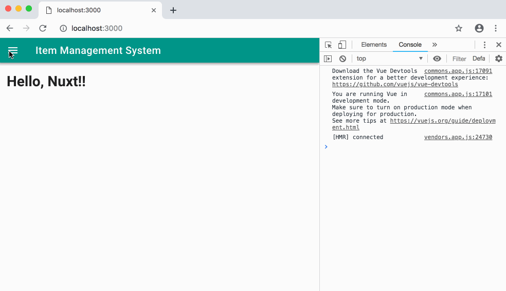

# nuxt-handson

- Nuxt.jsに入門するためのハンズオンです。
- シンプルなWebアプリケーションを段階的に実装していきます。
- 特定のツールを使用せずに、ゼロからNuxt.jsをインストールしてプロジェクトを作成します。
- Nuxt.jsの標準機能のほか、API通信にaxios、UIコンポーネントにVuetify.jsを使用しています。

## Output

||
|:---:|

## Contents

|Title|Description|
|---|---|
|[00-setup](./00-setup/README.md)|開発環境について|
|[01-hello-nuxt](./01-hello-nuxt/README.md)|Nuxt.jsのインストールと最小限の実装|
|[02-routing](./02-routing/README.md)|ルーティングの実装|
|[03-api-connection](./03-api-connection/README.md)|axiosを使用したAPIの繋ぎこみ|
|[04-vuetify](./04-vuetify/README.md)|Vuetify.jsを使用したマテリアルデザインの適用|
|[99-api-mock](./99-api-mock/README.md)|Web APIのモック|

- 各ディレクトリには手順書(`README.md`)とサンプルコードが格納されています。
- 各ディレクトリ直下で`$ npm install`後に`$ npm start`を実行すると、サンプルの動作確認ができます。
- `03-api-connection`と`04-vuetify`については、`99-api-mock`を同時に起動する必要があります。
